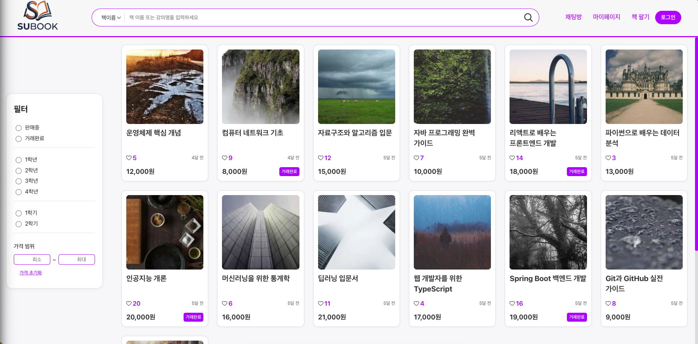
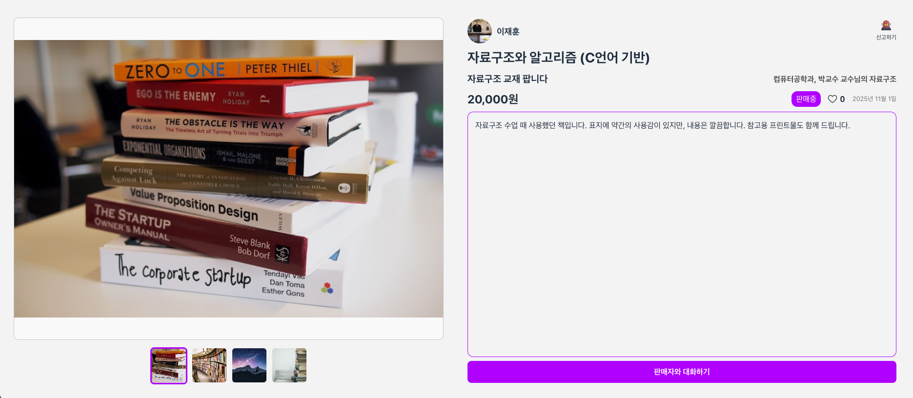
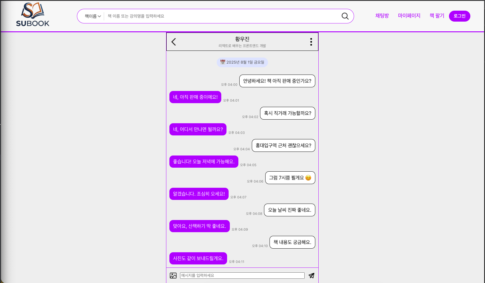

### **1. 📌 프로젝트 개요**

> 한 학기만 쓰고 방치되는 전공 서적들을 아깝게 버리지 않고, **같은 학교 학생들끼리 합리적인 가격에 사고팔 수 있는** 중고 거래 시스템.
>판매자는 수익을 얻고, 구매자는 저렴하게 책을 구할 수 있는 선순환 구조를 목표로 개발함.

### **2. 👨‍💻 개발 팀원**

- **Frontend:** 강재훈
- **Backend:** 정용현, 서준식, 최윤빈

---

### **3. ⚙️ 프론트엔드 기술 스택**

---

### **4. 📷 프로토타입**

---

### **5. 🚀 주요 기능 & 구현 결과**

- **책 검색 및 실시간 상태:** 필터 기능으로 원하는 책을 빠르게 찾을 수 있고, 판매 중/예약/완료 상태를 바로 확인할 수 있음.
- **관심 도서(찜):** 고민 중인 책은 하트 버튼을 눌러 저장해둘 수 있음.
- **1:1 채팅 및 안전 기능:** 구매자와 판매자가 실시간으로 대화할 수 있으며, 악성 유저 차단 및 신고 기능을 포함했습니다.

---

### **6. 🔧 개선 방향**

**💬 인터페이스 개선**
- 디자이너의 부재로 UI가 구식 같아 보이고 서비스의 UI가 일정하지 않음
- 책을 판매하기 위한 등록 페이지의 입력칸을 비율에 맞게 조정할 필요가 있음

**🛠 기능 보완**
- 검색어와 함꼐 필터 기능 이용시 간혹 제대로 적용되지 않던 문제

**🎨 디자인 개선**
- **폰트와 글자 크기의 통일성이 없음**
- 레이아웃 정리 및 UI 일관성 개선

---

### **🤔막혔던 문제와 해결 경험**

**이미지 403 에러와 보안 문제**

- `Access-Control-Expose-Headers:*` 로 인해 로그인 토큰이 발급 되지 않았음
  - [중요한 정보는 일부러 보여주지 않는다](https://velog.io/@why_does_it_work/응답이-와도-토큰만-없어서-고민이-당신에게-공유하는-블로그) 
- 서버에서는 이미지가 잘 보이는데, 프론트엔드 브라우저에서만 403 에러가 뜨며 이미지가 뜨지 않는 현상이 발생
  - [유효시간이 있는 Presigned URL 한입 해보세요](https://velog.io/@why_does_it_work/S3-이미지의-403-Forbidden-에러-Presigned-URL로-해결하기) 

**하트 버튼 클릭 시 페이지 이동 문제**

- UI 요소들이 겹쳐 있을수록 사용자의 클릭이 어떻게 전달될지 미리 예측하는 게 중요하다는 걸 깨달음. 단순 구현을 넘어 이벤트 버블링 같은 브라우저의 기본 원리도 추가로 공부해야 할 필요성을 느낌
